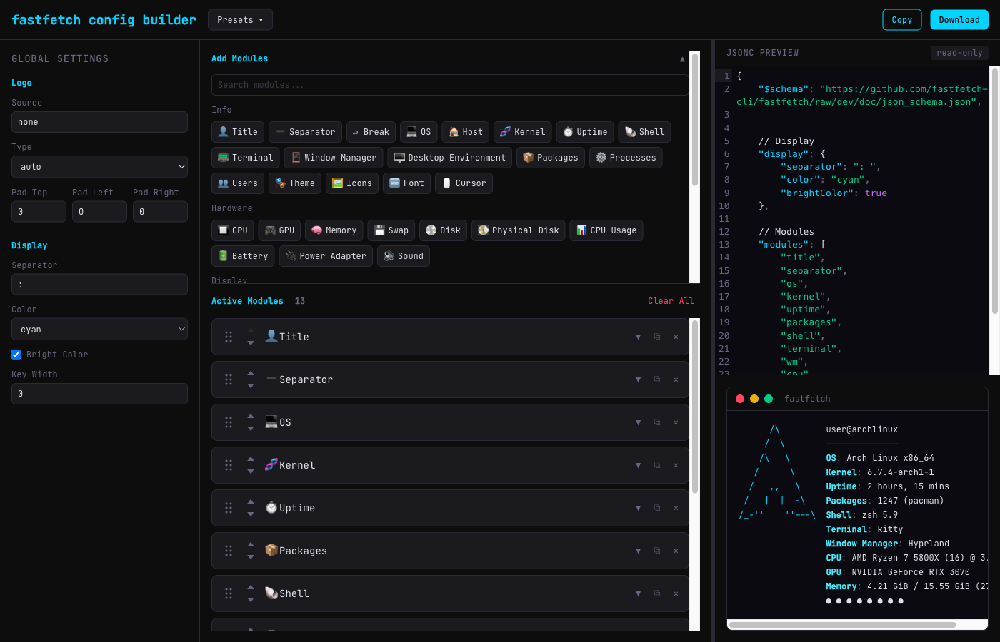

# fastfetch config builder

A visual web UI for building [fastfetch](https://github.com/fastfetch-cli/fastfetch) configurations. Instead of editing JSON files by hand, use a drag-and-drop interface with live preview.



## Features

- **40+ modules** — CPU, GPU, Memory, Disk, Network, Display, and more, organized by category
- **Drag-and-drop reordering** — rearrange modules with drag handles or up/down buttons
- **Per-module options** — customize labels, colors, separators, and type-specific settings
- **Global settings** — configure logo source/type/padding, display separator, ANSI color, key width
- **Live JSONC preview** — see the exact config file update in real time
- **Terminal mockup** — approximate preview of what fastfetch output will look like
- **Presets** — start from Neofetch, Minimal, Hardware, or Developer presets
- **Auto-save** — configuration persists in localStorage across sessions
- **Copy & Download** — export your config as a `.jsonc` file or copy to clipboard
- **Resizable panels** — adjust panel widths to your preference

## Getting Started

```bash
# Install dependencies
npm install

# Start dev server
npm run dev
```

Open [http://localhost:5173](http://localhost:5173) in your browser.

## Usage

1. **Pick a preset** or start from scratch
2. **Click modules** from the palette to add them to your config
3. **Drag to reorder** or use the arrow buttons
4. **Expand a module** to configure its options (key label, colors, type-specific settings)
5. **Adjust global settings** in the left sidebar (logo, separator, color scheme)
6. **Copy or download** the generated JSONC config
7. Place the file at `~/.config/fastfetch/config.jsonc`

## Tech Stack

- [React](https://react.dev) + [TypeScript](https://www.typescriptlang.org)
- [Vite](https://vite.dev) — build tool
- [Tailwind CSS](https://tailwindcss.com) — styling
- [Zustand](https://zustand.docs.pmnd.rs) — state management with localStorage persistence
- [Framer Motion](https://www.framer.com/motion) — drag-and-drop reordering and animations
- [CodeMirror](https://codemirror.net) — JSONC syntax-highlighted preview

## Scripts

| Command | Description |
|---------|-------------|
| `npm run dev` | Start development server |
| `npm run build` | Type-check and build for production |
| `npm run preview` | Preview production build locally |
| `npm run typecheck` | Run TypeScript type checking |

## Project Structure

```
src/
├── components/
│   ├── Header.tsx            # Title bar with preset loader
│   ├── GlobalSettings.tsx    # Logo and display settings sidebar
│   ├── ModuleList.tsx        # Active modules with reorder support
│   ├── ModulePalette.tsx     # Available modules grid
│   ├── ModuleCard.tsx        # Individual module with options editor
│   ├── JsonPreview.tsx       # Live JSONC config preview
│   ├── TerminalMockup.tsx    # Terminal output preview
│   └── PresetLoader.tsx      # Preset dropdown
├── store/
│   └── configStore.ts        # Zustand store with persistence
├── lib/
│   ├── moduleDefinitions.ts  # Module metadata and type definitions
│   ├── generateJsonc.ts      # State → JSONC config generator
│   └── presets.ts            # Built-in preset configurations
├── hooks/
│   └── useResizeHandle.ts    # Resizable panel hook
└── App.tsx                   # Root layout
```

## License

MIT
